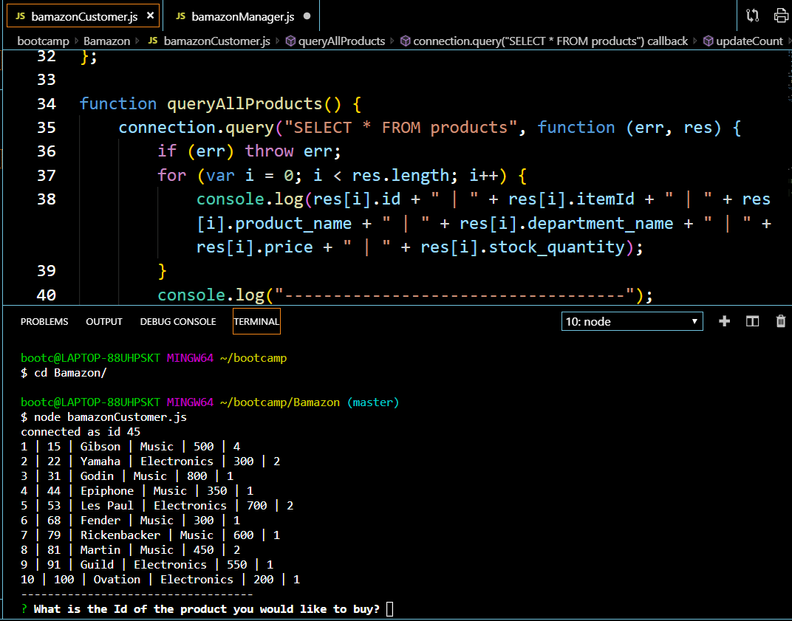
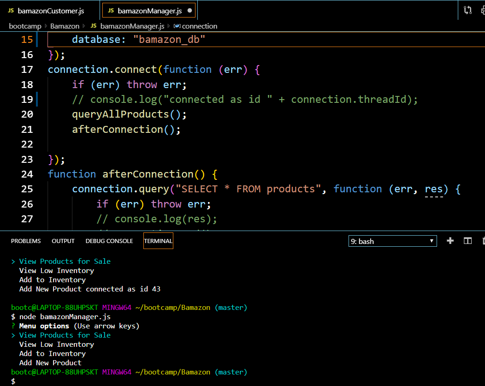
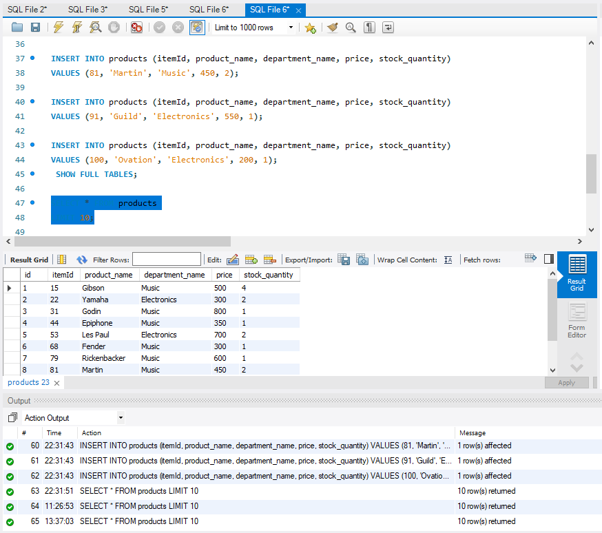

# Bamazon

The purpose of this app to allow customer to order product by item id. Checking and updating stock quantity from the command line to the database. Manager app to view and add inventory and and add new products.

The npm packages used were the inquirer and mysql.

The below links are screen shots of executed commands and database.

